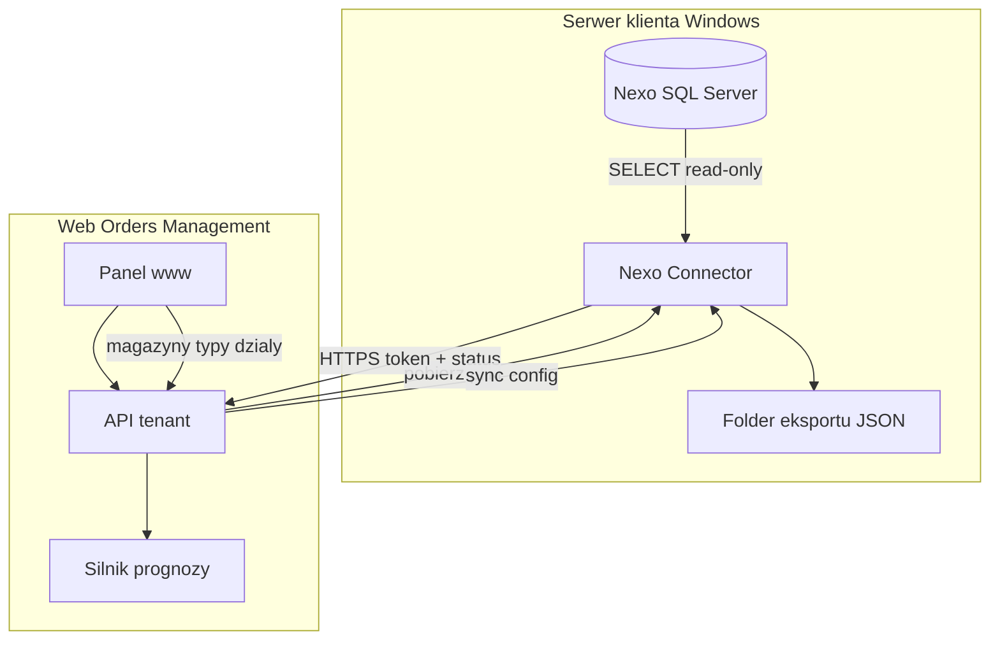

# Plan architektury v2 — Nexo Connector + Web Panel

**Status:** iteracja planu (zatwierdzenie przed implementacją)  
**Zastępuje:** ręczny eksport JSON / czysty SFTP jako główny model integracji

---

## 1. Werdykt: tak, łącznik jest lepszy

Sam model „4 pliki JSON + mapowanie ręczne” **nie wystarczy** dla:
- wielu magazynów,
- wielu firm (osobne bazy Nexo),
- działów sprzedaży,
- wykluczeń typów asortymentu (usługi),
- wdrożeń u innych klientów (multi-tenant).

**Docelowy model:**

| Warstwa | Rola |
|---------|------|
| **Nexo Connector** | Program Windows na serwerze klienta — SQL read-only → generuje 4 pliki JSON |
| **Web Panel** | Konfiguracja zakresu (magazyny, typy, działy), token, status, prognoza |
| **JSON** | Format wymiany (nie interfejs dla użytkownika) |

Użytkownik końcowy **nie** pisze SQL ani nie mapuje kolumn — robi to łącznik + domyślne mapowanie Nexo.

---

## 2. Co z magazynami, podmiotami, działami?

### Magazyny (`Magazyny`, `StanyMagazynowe`)

- Stan w Nexo jest **per asortyment + magazyn** (`Asortyment_Id`, `Magazyn_Id`).
- **Web (ustawienia zakresu):**
  - wybór: wszystkie / wybrane symbole magazynów,
  - tryb agregacji:
    - **suma** — jeden wiersz SKU, stany zsumowane z wybranych magazynów (domyślne dla zakupów),
    - **per magazyn** — osobny wiersz per SKU+magazyn (dla firm z silnym podziałem).
- **Łącznik:** stosuje filtr `Magazyny.Symbol IN (...)` w SQL.

### Podmioty / „firma” (multi-company)

W Nexo SDK **nie ma wielu firm w jednej bazie SQL** w sensie tenantów:
- **Jedna baza SQL = jedna instalacja / jedna firma operacyjna.**
- `Podmioty` w Nexo to **kontrahenci** (klienci, dostawcy), nie „Twoja firma”.
- Grupa z wieloma spółkami = **osobne bazy** (`DanePolaczenia.baza`).

**Web + łącznik:**
- Przy parowaniu łącznik zwraca: `server`, `database`, `nexo_version`, lista magazynów, rodzajów asortymentu, działów.
- Jeśli klient ma 3 bazy Nexo → **3 instancje łącznika** (lub 1 łącznik z wieloma profilami eksportu — faza 2).
- W web: profil = `connector_id` + zakres ustawień.

### Działy sprzedaży (`DzialySprzedazy`)

- W Nexo dział jest przypisany do **asortymentu** (M2M), nie do nagłówka dokumentu.
- **Web:** wybór działów (drzewo) → filtr sprzedaży: tylko pozycje asortymentów z wybranych działów (+ opcjonalnie poddrzewo).
- **Łącznik:** JOIN przez tabelę łączącą asortyment↔dział (nazwa junction — do odczytu ze schematu klienta).

### Rodzaje asortymentu (`RodzajeAsortymentu`)

- Symbole instalacyjne: `TW`, `KT`, `US`, … (`StanyMagazynowe = false` dla usług).
- **Web:** checklist „wyklucz typy” — domyślnie **US** (usługi) off.
- **Łącznik:** `WHERE r.Symbol NOT IN (...)` lub `r.StanyMagazynowe = 1`.

---

## 3. Architektura systemu

### Nexo Connector (Windows)

**Instalacja:** MSI / self-contained .NET na serwerze z dostępem do SQL Nexo.

**Konfiguracja lokalna (pierwsze uruchomienie):**
1. `tenant_id` + `api_token` z panelu www (parowanie).
2. SQL: serwer, baza, użytkownik **read-only**.
3. Folder eksportu (domyślny, np. `C:\NexoExport\`).
4. Harmonogram: co ile godzin / dni tygodnia (cron).

**Cykl pracy:**
1. Pobierz **config scope** z web API (magazyny, wykluczenia, działy, okno historii).
2. Wykonaj zapytania SQL (4 zestawy danych) → zapisz:
   - `products.json`, `sales.json`, `purchase_orders.json`, `stock_moves.json`
3. Raportuj do web: `last_export_at`, `file_sizes`, `row_counts`, `errors`.
4. Nasłuchuj HTTPS (localhost / LAN): web **pobiera pliki** z folderu przez API łącznika.

**Bezpieczeństwo:**
- Token w nagłówku `Authorization: Bearer …`
- TLS (certyfikat lokalny lub reverse proxy)
- SQL: tylko SELECT, dedykowane konto
- Baza Nexo **nigdy** nie wystawiona do internetu

**Połączenie z Nexo:** **SQL read-only** (decyzja użytkownika) — bez pełnej Sfery w v1.

### Web Panel

**Nowa sekcja: Integracje → Nexo Connector**

| Element | Opis |
|---------|------|
| Pobierz łącznik | Link do instalatora + `tenant_id` |
| Token API | Generowany w admin / licencja (już jest HMAC token) |
| Status | online / ostatni eksport / błąd SQL |
| **Zakres Nexo** | magazyny, wykluczone typy, działy, agregacja stanów |
| Odkryte z Nexo | lista magazynów, typów, działów (z łącznika) |
| Import | „Pobierz dane z łącznika” → kopiuje JSON do `uploads/` → run |

**Ręczny upload JSON** — zostaje jako fallback / testy.

**Mapowanie kolumn** — domyślne mapowanie Nexo wbudowane w łącznik; w web tylko override opcjonalny.

---

## 4. API między web a łącznikiem (szkic)

| Endpoint | Kierunek | Opis |
|----------|----------|------|
| `POST /connector/register` | connector → web | Parowanie tokenem, zwraca `connector_id` |
| `GET /connector/config` | connector ← web | Scope: magazyny, typy, działy, okno dni |
| `POST /connector/heartbeat` | connector → web | Status, wersja, database name |
| `POST /connector/catalog` | connector → web | Magazyny, RodzajeAsortymentu, DzialySprzedazy |
| `GET /connector/files/{name}` | web ← connector | Pobranie `products.json` itd. z folderu |
| `POST /connector/trigger-export` | web → connector | Wymuszenie eksportu natychmiast |

*Implementacja: web może **inicjować** połączenie wychodzące do łącznika (jeśli ma stały URL / tunel) **albo** łącznik utrzymuje outbound heartbeat i web kolejkuje „fetch” na następny heartbeat — do ustalenia w fazie implementacji łącznika.*

**Decyzja użytkownika:** web pobiera pliki **przez łącznik** z lokalnego folderu (nie bezpośredni dostęp do dysku klienta z chmury).

---

## 5. 4 pliki JSON — bez zmian semantyki

Łącznik generuje te same pliki co w [`NEXO_EKSPORT.md`](NEXO_EKSPORT.md), z filtrami scope:

| Plik | Filtry scope |
|------|----------------|
| products | magazyny, wykluczone typy, opcj. agregacja |
| sales | działy (via asortyment), typy, okno dat, tylko FS/PA |
| purchase_orders | otwarte ZD, magazyn |
| stock_moves | PZ/WZ, magazyny, okno dat |

Formuła prognozy: bez zmian — [`FORMULA.md`](FORMULA.md).

---

## 6. Fazy implementacji (rewizja)

### Faza A — Dokumentacja ✅ (w toku)
- [x] `NEXO_EKSPORT.md`, `FORMULA.md`, `WYMAGANE_DANE.md`
- [ ] `PLAN_ARCHITECTURE.md` (ten plik)
- [ ] Domknięcie `docs.html`, `WYMAGANE_DANE.txt`

### Faza B — Web: zakres Nexo + API connector (bez instalatora)
- Ustawienia: magazyny, typy, działy, agregacja
- Model `connector_config` w `settings_store`
- Endpointy API + status w Integracjach
- Mock connector (skrypt Python symulujący łącznik do testów)
- Import z mock → istniejący pipeline

### Faza C — Silnik prognozy (jak wcześniej)
- `stockout.py`, `forecast_notes.py`, 4 pliki w pipeline
- Excel 10–20 punktów uwag

### Faza D — Nexo Connector (Windows)
- .NET console/service, SQL read-only
- Eksport 4 JSON + catalog + heartbeat
- Lokalny HTTPS API do pobierania plików
- Instalator + dokumentacja wdrożeniowa

### Faza E — Multi-tenant / admin
- Panel admin: wydawanie tokenów per firma
- Limity SKU, ważność licencji (już częściowo jest)

---

## 7. Co z obecnym SFTP?

- **Zostaje** jako alternatywa (firma bez łącznika, inny ERP w przyszłości).
- **Primary path dla Nexo:** Connector.
- UI Integracje: kafelek „Nexo Connector” obok SFTP.

---

## 8. Ryzyka

| Ryzyko | Mitygacja |
|--------|-----------|
| Web nie widzi łącznika za NAT/firewall | Outbound heartbeat z łącznika; tunel / stały IP opcjonalnie |
| Różne schematy junction dział↔asortyment | Discovery query przy pierwszym połączeniu; log błędu |
| SQL read-only omija reguły Sfery | Tylko SELECT; dokumentacja: nie do zapisu |
| Wiele baz = wiele firm | 1 connector profile = 1 baza; admin tworzy wiele profili |

---

## 9. Odpowiedź na pytanie „czy to lepsze?”

**Tak** — dla produktu wielofirmowego i sensownego Nexo:

1. **Magazyny / typy / działy** — konfiguracja w web, egzekucja w łączniku.
2. **Podmiot (firma)** — wybór bazy SQL przy konfiguracji łącznika; web pokazuje co jest podłączone.
3. **Inna firma** — dostaje panel + token + instalator; bez ręcznego SQL.
4. **JSON** — format wewnętrzny, nie obciąża użytkownika.
5. **SQL read-only** — prostsze wdrożenie niż Sfera (decyzja zaakceptowana).

**Kolejność:** dokończyć Fazę A → Faza B (web + mock łącznika) → Faza C (prognoza) → Faza D (prawdziwy Windows connector).
