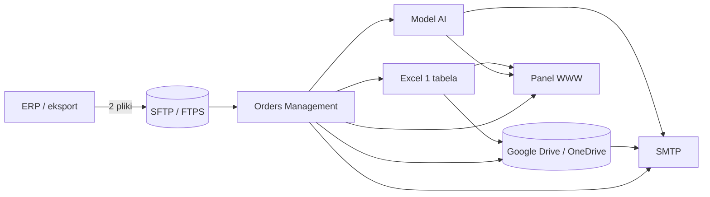
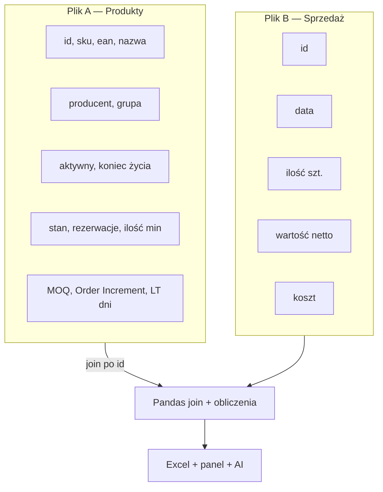
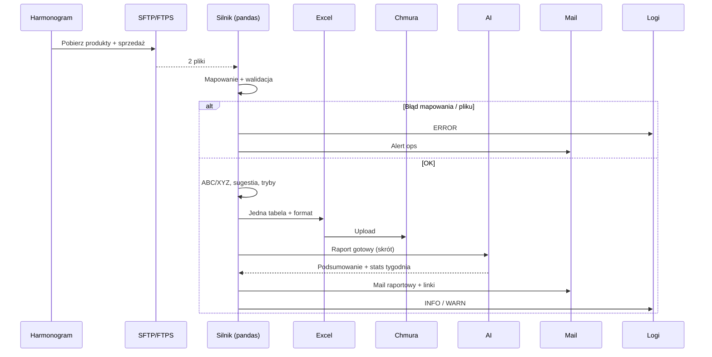
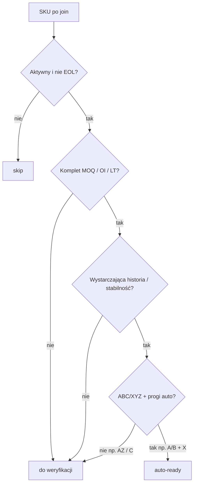
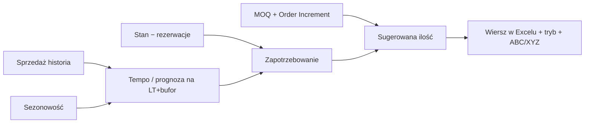
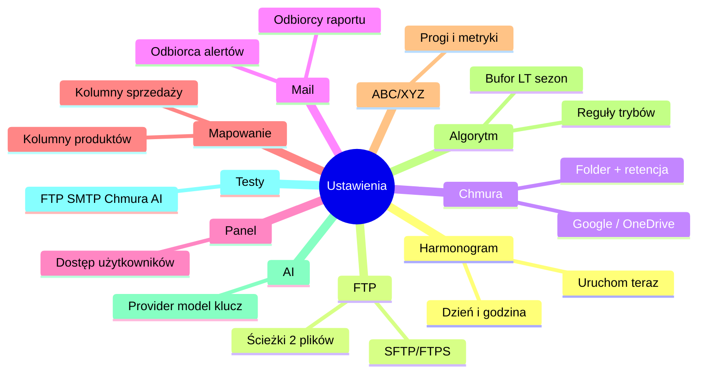
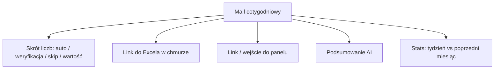

# Orders Management — Schematy

Do prezentacji Jackowi. Diagramy w Mermaid (podgląd w VS Code / GitHub / wielu viewerach Markdown).

---

## 1. Architektura ogólna

---

## 2. Dwa pliki wejściowe

---

## 3. Flow cotygodniowy (szczegół)

---

## 4. Logika decyzji na wierszu (tryb)

---

## 5. Od danych do sugerowanej ilości

---

## 6. Ustawienia (mapa ekranów)

---

## 7. Co dostaje odbiorca maila

